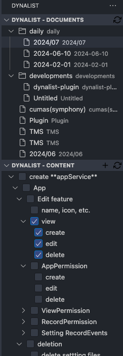

# Dynalist Simple Plugin

The Dynalist Simple Plugin allows you to integrate your Dynalist documents into Visual Studio Code. This plugin provides a convenient way to view, and edit your Dynalist documents without leaving your coding environment.
Note that this is unofficial plugin.

## Features

- **View Document List:** Display a tree view of your Dynalist documents and folders in the sidebar.
- **View Document Content:** Click on a document to fetch and display its content.
- **Context Menu Commands:** Right-click on document content items to:
  - Insert new nodes
  - Indent or outdent nodes
  - Delete nodes

## Getting Started

1. **Input Your API Token:**
   - Get your API token via [dynalist's developper page](https://dynalist.io/developer).
   - When the plugin is activated, it will prompt you to enter your Dynalist API token if not already saved.
   - You can also manually run the command `Dynalist: Update API Token` via the Command Palette (`Ctrl+Shift+P`).

2. **View Document List:**
   - Run the command `Dynalist: Show Document List` via the Command Palette (`Ctrl+Shift+P`).
   - Your Dynalist documents and folders will appear in the sidebar under the "Dynalist" section.

3. **View/Edit Document Content:**
   - Click on any document in the sidebar to load its content in the "Document Content" panel.

## License

This project is licensed under the MIT License.

## Acknowledgements

- [Dynalist API Documentation](https://apidocs.dynalist.io/) for providing the API reference.
- [Visual Studio Code Extension API](https://code.visualstudio.com/api) for the development guidelines.
