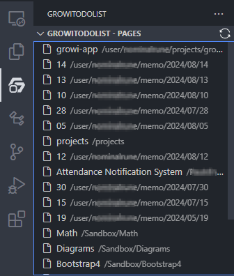

# Growi Todo List
[日本語](#日本語)

The Growi Todo List allows you to integrate your Growi Pages into Visual Studio Code. This plugin selectively shows only lists. They're rendered as a check list. As a supplemental feature, offers editor to show and edit the whole page as well.
Note that this is unofficial plugin.

## Features
- List Recent Pages
   - 
   - Run the command `GrowiTodoList: List pages` via the Command Palette (`Ctrl+Shift+P`).
   - Your Growi pages will appear in the sidebar under the "GrowiTodoList" section.
- Show Todo list
   - Click the page title in List view.
   - Your Growi page will appear in the sidebar under the "GrowiTodoList" section.
   - You can check or uncheck list items.
- View/Edit Page Content
   - 
   - Click edit icon on any page in the sidebar to edit its content in the editor.
## Getting Started

1. **Input Your Site Url:**
   - Get your site's url.
   - When the plugin is activated, it will prompt you to enter your site url if not already saved.
   - You can also manually run the command `GrowiTodoList: Save url` via the Command Palette (`Ctrl+Shift+P`).
   
1. **Input Your API Token:**
   - Get your API token.
   - When the plugin is activated, it will prompt you to enter your Growi API token if not already saved.
   - You can also manually run the command `GrowiTodoList: Save API Token` via the Command Palette (`Ctrl+Shift+P`).

## License

This project is licensed under the MIT License.

## Acknowledgements

- [Visual Studio Code Extension API](https://code.visualstudio.com/api) for the development guidelines.

# 日本語
Growi Todo List を使うと、Growi ページを Visual Studio Code に統合することができます。このプラグインはページ内のリスト形式のデータのみを取得して、todoリストとして表示します。おまけ機能として、ページ全体を表示・編集するエディタもあります。
非公式・個人提供のプラグインです。

## 機能
- 最近のページ一覧
   - 
- Todoリストの表示
- ページ内容の表示/編集
   - 
## セットアップ
1. サイトURLの入力
   - プラグインが有効化されると、サイトのURLを入力するプロンプトが表示されます。ご使用のGrowiのサイトアドレスを入力してください。
   - 手動でコマンドパレットから `GrowiTodoList： コマンドパレット`(`Ctrl+Shift+P`)から手動で`GrowiTodoList: Save url`コマンドを実行することもできます。
   
1. API トークンを入力
   - Growiのユーザーページから、APIトークンを取得します。
   - `GrowiTodoList： コマンドパレット (`Ctrl+Shift+P`) を使って `GrowiTodoList: Save API Token` コマンドを実行し、APIトークンを入力してください。